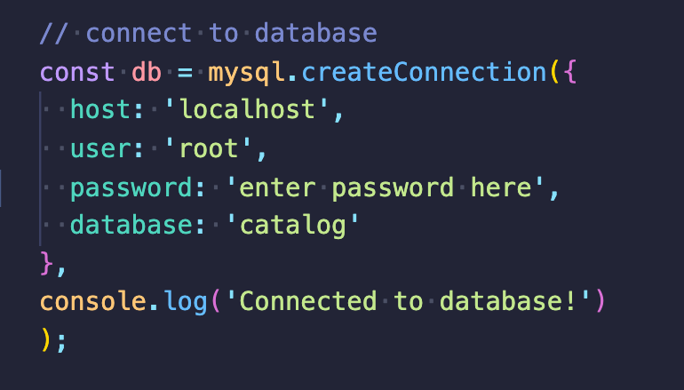

# Employee Tracker (CMS)

## Description: 
- Command-line application that accepts user input
- Options: view all departments, view all roles, view all employees, add a department, add a role, add an employee, and update an employee role
- To connect to the database make sure you have installed mySQL and have a password set up. In the config/connections.js document fill in your username and password information.

## Demo 
- <a href="https://drive.google.com/file/d/10UfPeFx8jhQsP5Aq0qvs19o2lWdvbhOw/view?usp=sharing">Link to Demo</a>
- Enter your mySQL password and username in the connection.js file





## Installation 

1. Clone the repository

```bash
git clone https://github.com/hthomp15/employee-tracker-CMS.git
```

2. Make sure you're in the working directory

```bash
cd employee-tracker-CMS
```

3. Install dependencies

```bash
npm install -y
npm install inquirer 
npm install mysql2 
npm install console.table
```

4. Set Up database in mySQL

``` bash 
SOURCE db/db.sql 
```
```bash
SOURCE db/schema.sql
```
```bash
SOURCE db/seeds.sql
```

5. Run the app

``` bash 
npm start
```


